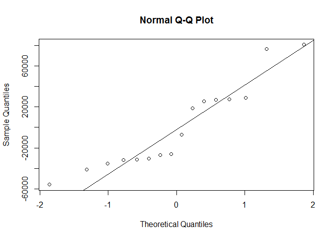

Assignment 1
================
17 July 2016

Hello Octocat
-------------

I love Octocat. She's the coolest cat in town. 

``` r
dim(anscombe)
```

    ## [1] 11  8

``` r
names(anscombe)
```

    ## [1] "x1" "x2" "x3" "x4" "y1" "y2" "y3" "y4"

``` r
head(anscombe, n=6)
```

    ##   x1 x2 x3 x4   y1   y2    y3   y4
    ## 1 10 10 10  8 8.04 9.14  7.46 6.58
    ## 2  8  8  8  8 6.95 8.14  6.77 5.76
    ## 3 13 13 13  8 7.58 8.74 12.74 7.71
    ## 4  9  9  9  8 8.81 8.77  7.11 8.84
    ## 5 11 11 11  8 8.33 9.26  7.81 8.47
    ## 6 14 14 14  8 9.96 8.10  8.84 7.04

``` r
tail(anscombe, n=6)
```

    ##    x1 x2 x3 x4    y1   y2   y3    y4
    ## 6  14 14 14  8  9.96 8.10 8.84  7.04
    ## 7   6  6  6  8  7.24 6.13 6.08  5.25
    ## 8   4  4  4 19  4.26 3.10 5.39 12.50
    ## 9  12 12 12  8 10.84 9.13 8.15  5.56
    ## 10  7  7  7  8  4.82 7.26 6.42  7.91
    ## 11  5  5  5  8  5.68 4.74 5.73  6.89

``` r
summary(anscombe)
```

    ##        x1             x2             x3             x4    
    ##  Min.   : 4.0   Min.   : 4.0   Min.   : 4.0   Min.   : 8  
    ##  1st Qu.: 6.5   1st Qu.: 6.5   1st Qu.: 6.5   1st Qu.: 8  
    ##  Median : 9.0   Median : 9.0   Median : 9.0   Median : 8  
    ##  Mean   : 9.0   Mean   : 9.0   Mean   : 9.0   Mean   : 9  
    ##  3rd Qu.:11.5   3rd Qu.:11.5   3rd Qu.:11.5   3rd Qu.: 8  
    ##  Max.   :14.0   Max.   :14.0   Max.   :14.0   Max.   :19  
    ##        y1               y2              y3              y4        
    ##  Min.   : 4.260   Min.   :3.100   Min.   : 5.39   Min.   : 5.250  
    ##  1st Qu.: 6.315   1st Qu.:6.695   1st Qu.: 6.25   1st Qu.: 6.170  
    ##  Median : 7.580   Median :8.140   Median : 7.11   Median : 7.040  
    ##  Mean   : 7.501   Mean   :7.501   Mean   : 7.50   Mean   : 7.501  
    ##  3rd Qu.: 8.570   3rd Qu.:8.950   3rd Qu.: 7.98   3rd Qu.: 8.190  
    ##  Max.   :10.840   Max.   :9.260   Max.   :12.74   Max.   :12.500

``` r
knitr::opts_chunk$set(echo = TRUE)
```

GitHub Documents
----------------

This is an R Markdown format used for publishing markdown documents to GitHub. When you click the **Knit** button all R code chunks are run and a markdown file (.md) suitable for publishing to GitHub is generated.

Including Code
--------------

You can include R code in the document as follows:

    ## 
    ## Attaching package: 'dplyr'

    ## The following objects are masked from 'package:stats':
    ## 
    ##     filter, lag

    ## The following objects are masked from 'package:base':
    ## 
    ##     intersect, setdiff, setequal, union


Including Plots
---------------

You can also embed plots, for example:

``` r
library(readr)

df <- file.path('analgesic.csv')
df <- data.frame('analgesic.csv')
df <- read.csv('analgesic.csv')
```

``` r
library(readr)

dim(df)
```

    ## [1] 40  5

``` r
names(df)
```

    ## [1] "ID"            "Group"         "Measurement_1" "Measurement_2"
    ## [5] "Measurement_3"

``` r
head(df, n=6)
```

    ##   ID     Group Measurement_1 Measurement_2 Measurement_3
    ## 1  1 Analgesic            26            26            21
    ## 2  2 Analgesic            29            26            23
    ## 3  3 Analgesic            24            28            22
    ## 4  4 Analgesic            25            22            24
    ## 5  5 Analgesic            24            28            23
    ## 6  6 Analgesic            22            23            26

``` r
tail(df, n=6)
```

    ##    ID   Group Measurement_1 Measurement_2 Measurement_3
    ## 35 35 Placebo            17            21            15
    ## 36 36 Placebo            19            17            15
    ## 37 37 Placebo            14            19            13
    ## 38 38 Placebo            17            19            13
    ## 39 39 Placebo            11            20            18
    ## 40 40 Placebo            15            18            12

``` r
summary(df)
```

    ##        ID              Group    Measurement_1   Measurement_2 
    ##  Min.   : 1.00   Analgesic:20   Min.   :10.00   Min.   : 8.0  
    ##  1st Qu.:10.75   Placebo  :20   1st Qu.:17.00   1st Qu.:17.0  
    ##  Median :20.50                  Median :20.00   Median :20.0  
    ##  Mean   :20.50                  Mean   :20.12   Mean   :20.7  
    ##  3rd Qu.:30.25                  3rd Qu.:24.00   3rd Qu.:25.0  
    ##  Max.   :40.00                  Max.   :30.00   Max.   :32.0  
    ##  Measurement_3  
    ##  Min.   :12.00  
    ##  1st Qu.:16.00  
    ##  Median :20.50  
    ##  Mean   :20.52  
    ##  3rd Qu.:24.25  
    ##  Max.   :30.00

``` r
library(tidyr)
library(dplyr)


df_1 <- gather(df, key = Key, value = Value, Measurement_1, Measurement_2, Measurement_3, -ID)
df_2 <- group_by(df_1)
df_2
```

    ## # A tibble: 120 x 4
    ##       ID     Group           Key Value
    ##    <int>    <fctr>         <chr> <int>
    ## 1      1 Analgesic Measurement_1    26
    ## 2      2 Analgesic Measurement_1    29
    ## 3      3 Analgesic Measurement_1    24
    ## 4      4 Analgesic Measurement_1    25
    ## 5      5 Analgesic Measurement_1    24
    ## 6      6 Analgesic Measurement_1    22
    ## 7      7 Analgesic Measurement_1    25
    ## 8      8 Analgesic Measurement_1    28
    ## 9      9 Analgesic Measurement_1    22
    ## 10    10 Analgesic Measurement_1    18
    ## # ... with 110 more rows

``` r
summarise(df_2, mean = mean(Value))
```

    ## # A tibble: 1 x 1
    ##    mean
    ##   <dbl>
    ## 1 20.45

chunk 1
=======

Null hypothesis
---------------

-   HO: The chicks weights is dependent on the feed \#\# Alternative hypothesis
-   H1: the chicks weight is not dependent on the feed

``` r
# read chick weight
x<-read.csv("chick-weights.csv")
# tidy the data
boxplot(x$weight~x$feed)
```


``` r
# state statistical test
chickanova <-aov(weight~feed, data = x)
summary(chickanova)
```

    ##             Df Sum Sq Mean Sq F value   Pr(>F)    
    ## feed         5 231129   46226   15.37 5.94e-10 ***
    ## Residuals   65 195556    3009                     
    ## ---
    ## Signif. codes:  0 '***' 0.001 '**' 0.01 '*' 0.05 '.' 0.1 ' ' 1

``` r
#underlying assumption
"compares means or samples of more than 3 groups"
```

    ## [1] "compares means or samples of more than 3 groups"

``` r
# degrees of freedom and p value
df = 5
"p-value < 0.05"
```

    ## [1] "p-value < 0.05"

``` r
"accept null hypothesis"
```

    ## [1] "accept null hypothesis"

\# chunk 2 \#hypothesis \#\# Null hypothesis \* Drinking contaminated water does not cause gastroenteritis \#\# Alternative hypothesis \* drinking contaminated water does cause gastroenteritis

``` r
library(knitr)
# read outbreak of severe gastroenteritis
x <- read.csv("gastroenteritis (1).csv")
y <- xtabs(~Consumption + Outcome, data = x)
y
```

    ##                     Outcome
    ## Consumption          ill not ill
    ##   < 1 glasses/day     39     121
    ##   > 4 glasses/day    265     146
    ##   1 to 4 glasses/day 265     258

``` r
barplot(y, beside = TRUE, ylab = "water consumption", xlab = "clinical presentation",main = "Investigation of gastroenteritis outbreak", col = c("blue", "green", "yellow"))
legend("top", c("<1 glasses/day", ">4 glasses/day", "1 to 4 glasses/day"), fill = c("blue", "green", "yellow"))
```


``` r
# statistical test
Z <- chisq.test(y, correct = TRUE)
Z
```

    ## 
    ##  Pearson's Chi-squared test
    ## 
    ## data:  y
    ## X-squared = 74.925, df = 2, p-value < 2.2e-16

Underlying assumptions
----------------------

-   two categorical variables from a single population
-   used to determine whether there is an association between 2 variable names \#\# interpretation of outcomes
-   p&lt; 0.05, therefor reject the null hypothesis and accept the alternative hypothesis

chunk 3 \#\# Null hypothesis \* Recieving chemotherapy does not cause nausea \#\# Alternative hypothesis \* Recieving chemotherapy does cause nausea

``` r
# read the intensity of nausea
A <- read.csv("nausea.csv")

#tidy data
# rating scale is anchored at 0(no nausea) to 6(severe nausea and vomiting) therefore change row 8 coloumn 3.
A[8,3] = 4
A
```

    ##   Patient Nausea_before Nausea_after
    ## 1       1             3            2
    ## 2       2             4            0
    ## 3       3             6            1
    ## 4       4             2            3
    ## 5       5             2            1
    ## 6       6             4            1
    ## 7       7             5            0
    ## 8       8             6            4

``` r
# plotting of data
plot(A$Nausea_before~A$Patient, type = "l", ylim = c(0,6), xlab = "Patients", ylab = "nausea score", main = "The intensity of nausea before and after receiving a 5ht3-receptor blocker")
lines(A$Nausea_after~A$Patient, col= "blue")
legend ("top", c("Nausea_before", "Nausea_after"),fill = c("black", "blue"))
```


``` r
# statistical test
wilcox.test(A$Nausea_before,A$Nausea_after, paired = TRUE)
```

    ## Warning in wilcox.test.default(A$Nausea_before, A$Nausea_after, paired =
    ## TRUE): cannot compute exact p-value with ties

    ## 
    ##  Wilcoxon signed rank test with continuity correction
    ## 
    ## data:  A$Nausea_before and A$Nausea_after
    ## V = 34, p-value = 0.02897
    ## alternative hypothesis: true location shift is not equal to 0

Test assumption
---------------

-   The data is paired and non-parametric
-   two measurements were taken from the same sample group.
-   P&lt; 0.05 Therefore reject the null hypothesis and accept the alternative hypothesis

Note that the `echo = FALSE` parameter was added to the code chunk to prevent printing of the R code that generated the plot.

Null hypothesis
===============

-   The housing price is not dependent on the interest rate \# Alternative hypothesis
-   The housing price is dependent on the interest rate

``` r
# import data

G <- read.csv("housing-prices.csv")
G
```

    ##    interest_rate median_house_price_USD
    ## 1             10                 183800
    ## 2             10                 183200
    ## 3             10                 174900
    ## 4              9                 173500
    ## 5              8                 172900
    ## 6              7                 173200
    ## 7              8                 173200
    ## 8              8                 169700
    ## 9              8                 174500
    ## 10             8                 177900
    ## 11             7                 188100
    ## 12             7                 203200
    ## 13             8                 230200
    ## 14             7                 258200
    ## 15             7                 309800
    ## 16             6                 329800

``` r
# Tidy data
interest= G$interest_rate
house_price = G$median_house_price_USD
head(cbind(interest, house_price))
```

    ##      interest house_price
    ## [1,]       10      183800
    ## [2,]       10      183200
    ## [3,]       10      174900
    ## [4,]        9      173500
    ## [5,]        8      172900
    ## [6,]        7      173200

``` r
# scatter plot
plot( interest, house_price, xlab= "interest", ylab = "house_price")
abline(lm(G$median_house_price_USD ~ G$interest_rate, data = G), col= "blue", lwd= 2)
```


``` r
# linear regression
G1 <- lm(G$median_house_price_USD ~ G$interest_rate, data = G)
summary(G1)
```

    ## 
    ## Call:
    ## lm(formula = G$median_house_price_USD ~ G$interest_rate, data = G)
    ## 
    ## Residuals:
    ##    Min     1Q Median     3Q    Max 
    ## -55865 -31631 -16406  27212  80735 
    ## 
    ## Coefficients:
    ##                 Estimate Std. Error t value Pr(>|t|)    
    ## (Intercept)       399229      74427   5.364 9.99e-05 ***
    ## G$interest_rate   -24309       9205  -2.641   0.0194 *  
    ## ---
    ## Signif. codes:  0 '***' 0.001 '**' 0.01 '*' 0.05 '.' 0.1 ' ' 1
    ## 
    ## Residual standard error: 43180 on 14 degrees of freedom
    ## Multiple R-squared:  0.3325, Adjusted R-squared:  0.2848 
    ## F-statistic: 6.974 on 1 and 14 DF,  p-value: 0.01937

``` r
 # diagnostic plot 1
plot( x= G1$fitted.values, y=G1$residuals, main = "Homoskedasticity", pch = 19, col= "blue")
abline(h=0, col= "green", lwd= 2)
```


``` r
#diagnostic plot 2 : Gaussian residual distribution
qqnorm(G1$residuals)
qqline(G1$residuals)
```



``` r
# Binary outcome variable: the variables have non-Gaussian error distribution
glm (G$median_house_price_USD ~ G$interest_rate, data = G)
```

    ## 
    ## Call:  glm(formula = G$median_house_price_USD ~ G$interest_rate, data = G)
    ## 
    ## Coefficients:
    ##     (Intercept)  G$interest_rate  
    ##          399229           -24309  
    ## 
    ## Degrees of Freedom: 15 Total (i.e. Null);  14 Residual
    ## Null Deviance:       3.91e+10 
    ## Residual Deviance: 2.61e+10  AIC: 390.8

\# test assumptions \* I did the scatter plot to determine the trend or the relationship \# disgnostics for linear regression \* I did qq plot to determine if the residuals are normally distributed \* I did the Gaussian residual distribution to determine the variance of the fitted values \* I did the generalized linear model because the diagnostics I ran were not normally distributed. \# test interpretation \* p-value = 0.01937 therefore reject the null hypotehsis and accept the alternative hypothesis. \* degrees of freedom : 15 Total (i.e. Null); 14 Residual \# test statistics \* F-statistic: 6.974 on 1
